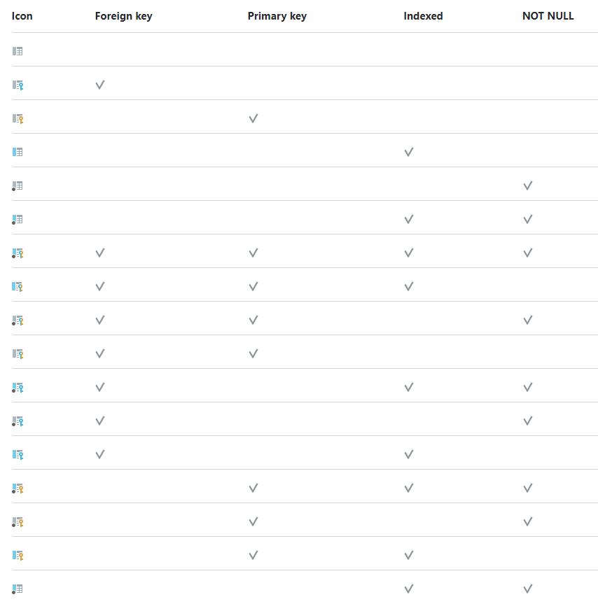

<h1>Useful GoLand Keyboard Shortcuts</h1>

[TOC]

# Shortcut Keys

## Windows

- **Code Completion** - *Ctrl+Space*
- **Quick Definition** - *Ctrl+Shift+I* or *Ctrl+NumPad-1*
- **Quick Type Definition** - *Ctrl+NumPad-2*
- **Quick Documentation** - *Ctrl+Q* or *Alt+Middle-Click* or *Ctrl+NumPad-3*

## Mac

- **Code Completion** - *Ctrl+Space*
- **Quick Definition** - *Ctrl+Shift+I* or *Ctrl+NumPad-1*
- **Quick Type Definition** - *Ctrl+NumPad-2*
- **Quick Documentation** - *Ctrl+Q* or *Alt+Middle-Click* or *Ctrl+NumPad-3*

| Action                | Shotcut 1         | Shortcut 2      |
| --------------------- | ----------------- | --------------- |
| Code Completion       | Ctrl+Space        |                 |
| Quick Definition      | Ctrl+Option+Space | Option+NumPad-1 |
| Quick Type Definition | Ctrl+Shift+Space  | Option+NumPad-2 |
| Quick Documentation   | Option+Space      | Option+NumPad-3 |

# Database Tool

**DataGrip** - Intellij IDE for Databases

https://www.jetbrains.com/help/datagrip/database-tool-window.html

## Possible icon combinations for columns

https://www.jetbrains.com/help/datagrip/database-tool-window.html#possible-icon-combinations-for-columns

